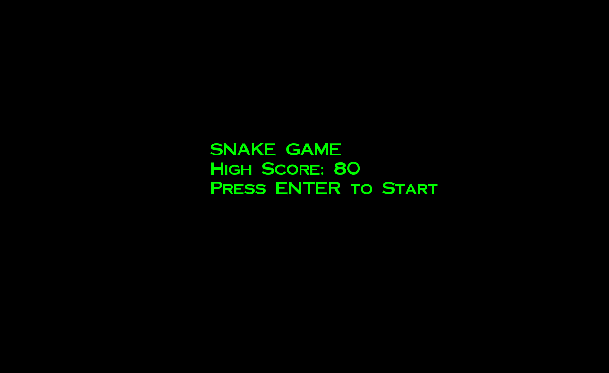

# Snake Game

The Snake Game is a classic, arcade-style C++ program built with the **SFML 3.0.0** library. It features a clean, object-oriented design and tracks your performance with a persistent high-score system.




## What It Does
This project recreates the timeless "Snake" experience with modern features:
* **Game States:** Seamlessly transition between a Main Menu, active gameplay, and a "Game Over" screen.
* **Classic Gameplay:** Navigate the snake to eat red apples, causing it to grow longer.
* **Collision Detection:** The game ends if you hit the boundaries of the window or collide with your own tail.
* **Scoring System:** Earn 10 points for every apple consumed.
* **High Scores:** Your best score is saved locally to a file (`assets/highscore.txt`) so you can track your progress over time.
* **Randomised Spawning:** Apples appear at new random locations on the grid after every meal.

## How to Use It

### Prerequisites
To run this project, you will need:
* **CMake** (Version 3.20 or higher).
* A **C++ Compiler** that supports **C++17**.
* **SFML 3.0.0:** The project is configured to automatically fetch this from GitHub during the build process.

### Running the Game
1.  **Clone the Repository:** Download the project files to your local machine.
2.  **Build the Project:** Open a terminal in the project folder and run:
    ```bash
    mkdir build
    cd build
    cmake ..
    cmake --build .
    ```
3.  **Start the Game:** Run the `SnakeGame` executable generated in your build folder.
4.  **Controls:**
    * Press **Enter** at the menu to start or restart the game.
    * Use the **Arrow Keys** (Up, Down, Left, Right) to control the snake's direction.
5.  **Final Results:** When you collide with a wall or yourself, your final score and the all-time high score will be displayed on the screen.

## Project Files
* **`src/main.cpp`:** The entry point that initializes and runs the game loop.
* **`src/Game.cpp` / `include/Game.hpp`:** Manages the window, game states (Menu/Playing/GameOver), and the high-score system.
* **`src/Snake.cpp` / `include/Snake.hpp`:** Handles snake movement, growth logic, and collision detection.
* **`src/Apple.cpp` / `include/Apple.hpp`:** Manages the random spawning and rendering of apples.
* **`assets/`:** Contains the game's font and the `highscore.txt` file.
* **`CMakeLists.txt`:** The build configuration file that manages dependencies and compilation.

## What's Next? (Roadmap)
- [ ] **Difficulty Levels:** Increase the snake's speed as the score gets higher.
- [ ] **Power-ups:** Special apples that grant temporary speed boosts or extra points.
